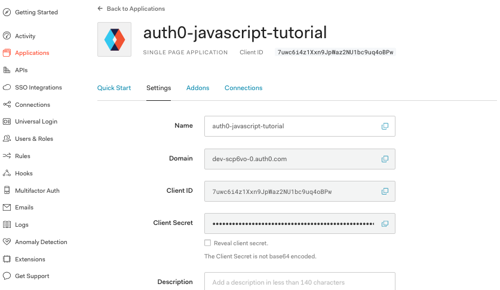
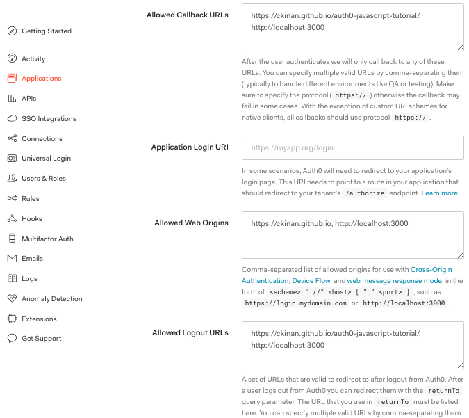
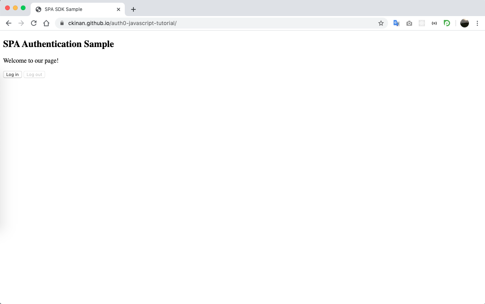
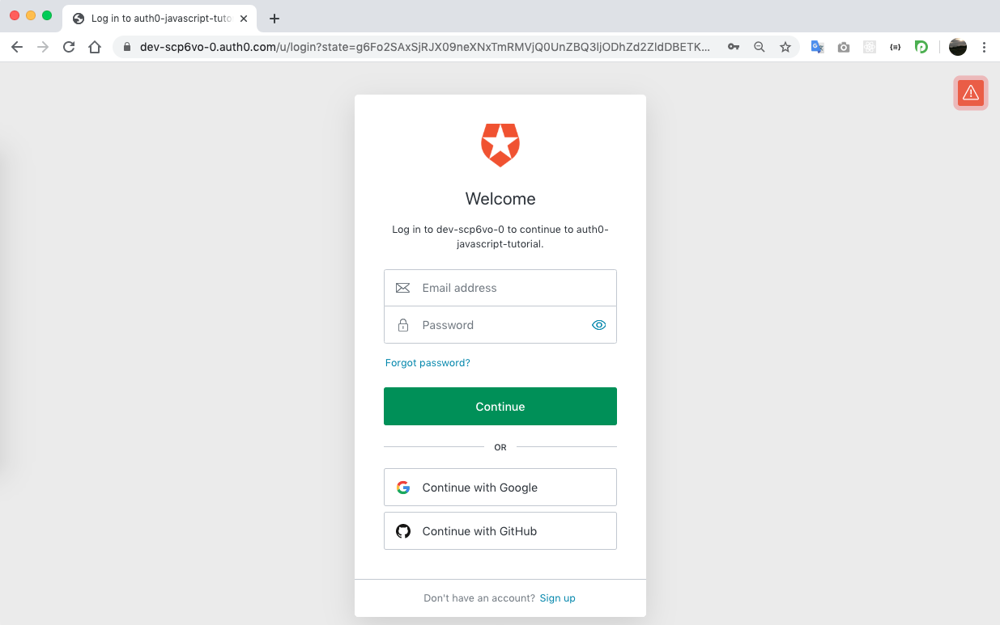
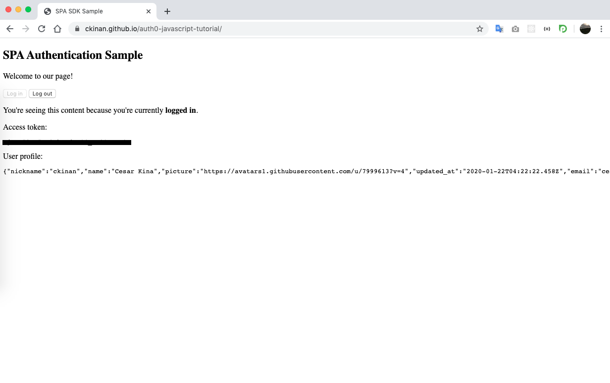

> Draft

Authentication with Auth0 following steps detailed in their documentation and getting its minimal valuable version.

<!--truncate-->

## Auth0 Settings

Domain and Client ID



Allowed Callback URLs, Allowed Web Origins, Allowed Logout URLs



## index.html

```html
<!DOCTYPE html>
<html>
  <head>
    <meta charset="UTF-8" />
    <title>SPA SDK Sample</title>
    
    <style>
      .hidden { display: none; }
      label { margin-bottom: 10px; display: block; }
    </style>

  </head>

  <body>
    <h2>SPA Authentication Sample</h2>
    <p>Welcome to our page!</p>
    <button id="btn-login" disabled="true" onclick="login()">Log in</button>
    <button id="btn-logout" disabled="true" onclick="logout()">Log out</button>

    <div class="hidden" id="gated-content">
      <p>
        You're seeing this content because you're currently
        <strong>logged in</strong>.
      </p>
      <label>
        Access token:
        <pre id="ipt-access-token"></pre>
      </label>
      <label>
        User profile:
        <pre id="ipt-user-profile"></pre>
      </label>
    </div>

    <script src="https://cdn.auth0.com/js/auth0-spa-js/1.2/auth0-spa-js.production.js"></script>
    <script src="app.js"></script>
  </body>
</html>
```

## app.js

```js
let auth0 = null;

window.onload = async () => {
    await configureClient();
    await processLoginState();
    updateUI();
};

const configureClient = async () => {
    auth0 = await createAuth0Client({
        domain: "dev-scp6vo-0.auth0.com",
        client_id: "7uwc6i4z1Xxn9JpWaz2NU1bc9uq4oBPw"
    });
};

const processLoginState = async () => {
    // Check code and state parameters
    const query = window.location.search;
    if (query.includes("code=") && query.includes("state=")) {
        // Process the login state
        await auth0.handleRedirectCallback();
        // Use replaceState to redirect the user away and remove the querystring parameters
        window.history.replaceState({}, document.title, window.location.pathname);
    }
};

const updateUI = async () => {
    const isAuthenticated = await auth0.isAuthenticated();
    document.getElementById("btn-logout").disabled = !isAuthenticated;
    document.getElementById("btn-login").disabled = isAuthenticated;
    // NEW - add logic to show/hide gated content after authentication
    if (isAuthenticated) {
        document.getElementById("gated-content").classList.remove("hidden");
        document.getElementById("ipt-access-token").innerHTML = await auth0.getTokenSilently();
        document.getElementById("ipt-user-profile").innerHTML = JSON.stringify(await auth0.getUser());
    } else {
        document.getElementById("gated-content").classList.add("hidden");
    }
};

const login = async () => {
    await auth0.loginWithRedirect({
        redirect_uri: window.location.href
    });
};

const logout = () => {
    auth0.logout({
        returnTo: window.location.href
    });
};
```

The above code snippet is a minified version of what Auth0 has prepared in their documentation. Basically, it establishes connection with the Application I created in their platform, then do some checks with the state of the authentication process to show or hide information about the user who is (or not) logged in. Below is the list of classes & methods that stricly come from the Auth0 SDK:

- createAuth0Client
- handleRedirectCallback
- isAuthenticated
- getTokenSilently
- getUser
- loginWithRedirect
- logout

There are some good content about each item listed above in their SDK documentation: [https://auth0.github.io/auth0-spa-js/](https://auth0.github.io/auth0-spa-js/)

## Test

Open [https://ckinan.github.io/auth0-javascript-tutorial/](https://ckinan.github.io/auth0-javascript-tutorial/)



Authenticate



See user information



## Links

- Auth0 Vanilla JS Tutorial: [https://auth0.com/docs/quickstart/spa/vanillajs](https://auth0.com/docs/quickstart/spa/vanillajs)
- Auth0 SDK for Single Page Applications: [https://auth0.github.io/auth0-spa-js/](https://auth0.github.io/auth0-spa-js/)
- Test: [https://ckinan.github.io/auth0-javascript-tutorial/](https://ckinan.github.io/auth0-javascript-tutorial/)
- Repo: [https://github.com/ckinan/auth0-javascript-tutorial](https://github.com/ckinan/auth0-javascript-tutorial)