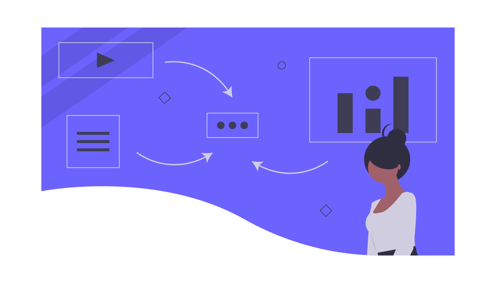
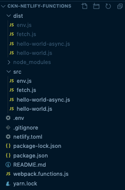
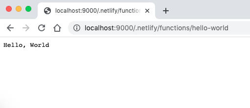
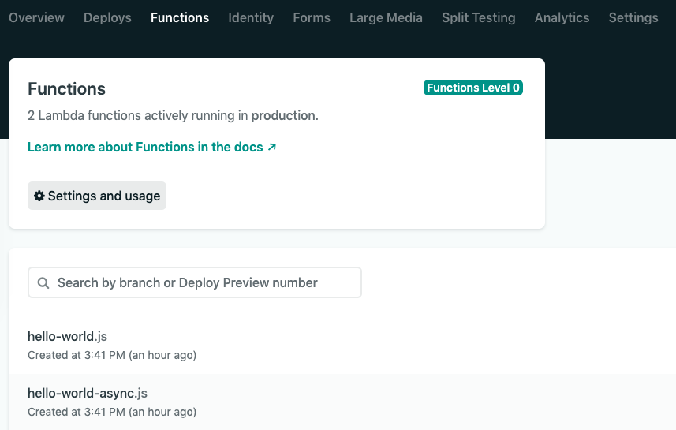
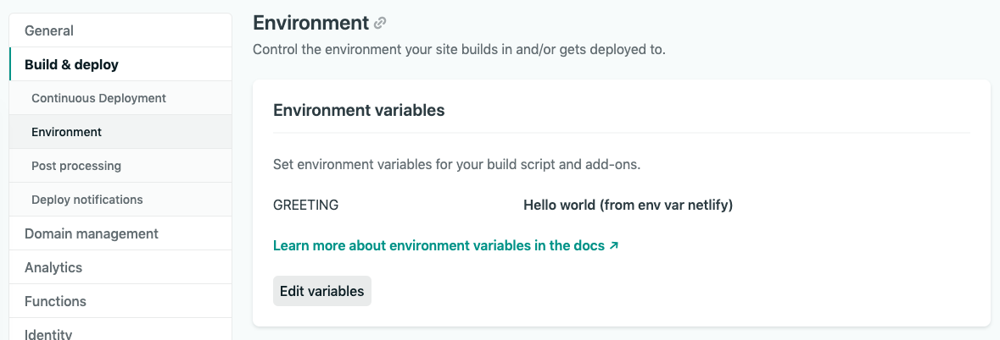

Exploring Netlify Functions: Concepts and some examples to get started with serverless functions.

<!--truncate-->



## Motivation

Sometimes I want to build simple web applications for demos or just for fun. These ideas relates interactions with APIs (free ones in most of the cases). However, even when these APIs have free plans, they force you to create an API KEY, which you don't want to expose for security reasons.

I don't want to use secret keys in a single font end web application, because that approach would expose my keys. So, I have to handle those in a server side (backend apps). And here is where serverless functions caught my attention.

There are some options I was checking to create and use serverless functions, but as I am already working with Netlify for this website, I wanted to give it a try and use "Netlify Functions".

## What is "Netlify Functions"?

Serverless functions on AWS Lambda, handled by Netlify. Create, build, deploy and test these serverless functions on Netlify and locally with some great tools that Netlify provides.

Currently, supported languages are:
- JavaScript
- Go

## Concepts

To get started with Netlify Functions, I've found some particulars to create, configure and serve your functions.

- netlify.toml (configuration file)
- Structure of a function (obviously)
- Commands to build and serve (the latter is optional if you want to deploy it locally)

Lets check some few details about them.

### netlify.toml

This file contains the configurations of your functions project. For this (very) small example, I am just specifying where the built functions are located ("dist" folder).

Ref: https://docs.netlify.com/configure-builds/file-based-configuration/

Example:

```
[build]
  functions = "dist" # build output will be here
```

### Structure of a function

From a "hello world" example found here: https://functions-playground.netlify.com/

```js
exports.handler = function(event, context, callback) {
  callback(null, {
    statusCode: 200,
    body: "Hello, World"
  });
};
```

Declare `exports.handler` function with the following parameters:

- `event` : Requests data
- `context` : Context of the call. Example: [Functions with Netlify Identity](https://docs.netlify.com/functions/functions-and-identity/#access-identity-info-via-clientcontext)
- `callback` : Creates reponses

## Commands to build and serve

- `netlify-lambda build` : Builds your function source code and place it into your built folder specified in the `netlify.toml` configuration file in `functions`. [Ref](https://github.com/netlify/netlify-lambda#netlify-lambda-build)
- `netlify-lambda serve` : Runs your function locally. [Ref](https://github.com/netlify/netlify-lambda#netlify-lambda-serve-legacy-command)

## Getting started (example step by step)

1. Initialize your project

```bash
npm init
```

2. Install `netlify-lambda` command locally

```bash
yarn add netlify-lambda
```

3. Create the `netlify.toml` file

```
[build]
  functions = "dist" # build output will be here
```

4. Add `build` and `serve` scripts to `package.json`. Note our source code folder is in `./src` path.

```js
  :
  "scripts": {
    "build": "netlify-lambda build src",
    "install": "netlify-lambda install src",
    "serve": "netlify-lambda serve src"
  },
  :
```

5. Create your first function and name the file as `hello-world.js`.

```js
exports.handler = function(event, context, callback) {
  callback(null, {
    statusCode: 200,
    body: "Hello, World"
  });
};
```

Your source tree should look like:



7. Deploy

Two options: Locally and on Netlify

7.1. Option 1: Locally

```js
npm run serve
```

You will see your port where your local function is exposed:

```
[0] ./hello-world.js 129 bytes {0} [built]
Lambda server is listening on 9000
```

Open in a browser: http://localhost:9000/.netlify/functions/hello-world

> Note: The path of the URL is: http://{host}:{port}/.netlify/functions/{your-function-name}) . We can't change the `.netlify/functions` as far as I know.

You will see the response of the function: "Hello, World"



7.2. Deploy on Netlify

Commit and push your project into Github/Gitlab/Bitbucket, and deploy your project in Netlify, where the "Build Command" should be in this case: `npm run install`. Once it got deployed, you can see the list of functions in Netlify under `Project > Functions`.



Click on any of your functions, you will see the URL to invoke it. Example


> Note: There are really good examples provided by Netlify Team of what you can do within a single function. I actually used them for this article. Link: https://functions-playground.netlify.com/

## Logging

Quoting docs: https://docs.netlify.com/functions/logs/

> Netlify displays a running log for the last hour of activity, including:
>
> - Start of each invocation
> - Any console.log() statements you include in your function code

## Environment variables

Following another example from https://functions-playground.netlify.com/ to get environment variables, create `env.js` under `src` folder.

```js
const GREETING = process.env.GREETING;

exports.handler = async (event, context) => {
  return {
    statusCode: 200,
    body: GREETING
  };
};
```

Here, `GREETING` is your environment variable. This is how you "hide" certain values you don't want to share publicly to your clients behind a serverless function like this. Even if your source code is public in Github, you won't need to have secret information in your code, but in environment variables like so.

In the above example, if you are running:

- Locally: Follow instructions in this link https://github.com/netlify/netlify-lambda/issues/118#issuecomment-506973346
- On Netlify: Just create an environment variable under `Project > Settings > Build & Deploy > Environment` option.



## Final thoughts

Netlify Functions is definitely a great choice to get started with serverless functions and it will (for sure) help me to accomplish what I was looking for: to hide api secret keys to invoke third party's APIs (more than likely I'll reuse the "fetch.js" example).

I am pretty sure there a lot more features Netlify provides within Functions behind the scenes happening that I am not aware of right now. But, I am happy with what I've just explored and learned about it, most importantly, Netlify is clear in their documentations and has a great community out there with super easy tutorials for beginners (like myself).

Github repo: https://github.com/ckinan/ckn-netlify-functions

## References

- Official docs: https://docs.netlify.com/functions/overview/
- `netlify-lambda`: https://github.com/netlify/netlify-lambda
- Local environment variables https://github.com/netlify/netlify-lambda/issues/118#issuecomment-506973346
- Great article to get started: https://kentcdodds.com/blog/super-simple-start-to-serverless
- Another great article: https://flaviocopes.com/netlify-functions/